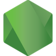

## Playground For JavaScript

### Direct Show Pages

- [https://aggresss.github.io/playground-js/webrtc/atomic/src/atomic.html](https://aggresss.github.io/playground-js/webrtc/atomic/src/atomic.html)

### Vendor Support

  
  

  
  

  
  

  
  
  

  
  
  
  

