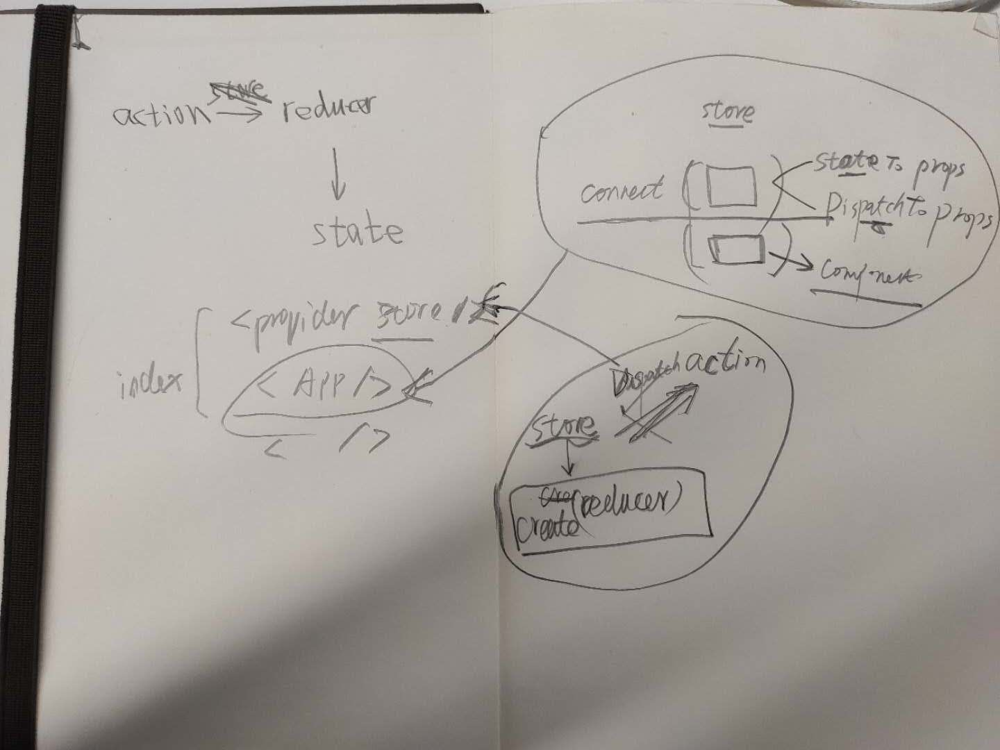

## Reference

- https://www.cnblogs.com/bax-life/p/8440326.html
- https://www.jianshu.com/p/db0bee45b2da
- https://github.com/vaibhavmule/react-redux-helloworld
- https://www.jianshu.com/p/85e4757814cd
- https://www.ruanyifeng.com/blog/2016/09/redux_tutorial_part_one_basic_usages.html
- https://www.ruanyifeng.com/blog/2016/09/redux_tutorial_part_two_async_operations.html
- https://www.ruanyifeng.com/blog/2016/09/redux_tutorial_part_three_react-redux.html

### 概念

- state 根据一些数据渲染 DOM，这些数据称为 state，不改变的值使用 props，而改变的值要使用 state。
- store 连接 actions 和 reducers，学习 redux 时，以 store 的操作作为分析线索
- state/store react 提供 state，redux 提供 store

- action 描述发生了什么
- reducer 根据 action 返回一个全新的 state

- store 对象包含所有数据。如果想得到某个时点的数据，就要对 store 生成快照。这种时点的数据集合，就叫做 state。
- **store dispatch action to reducer => reducer return state by action**

react-redux 为了方便开发，提供了一个 Provider 组件，以及 connect 方法。

connect() 接收四个参数，它们分别是

- mapStateToProps
- mapDispatchToProps
- mergeProps
- options

mapStateToProps(state, ownProps) : stateProps 这个函数允许我们将 store 中的数据作为 props 绑定到组件上。
mapDispatchToProps，它的功能是，将 action 作为 props 绑定到 MyComp上。

Redux 的核心是一个 store，这个 store 由 Redux 提供的 createStore(reducers[，initialState]) 方法生成。要想生成 store，reducers，同时也可以传入第二个可选参数初始化状态 initialState。

Redux 最核心的 API ---- createStore，通过 createStore 方法创建的 store 是一个对象，它本身又包含4个方法。

- dispatch()
- subscribe()
- getState()
- replaceReducer()

#### store

一个 Redux 应用中只有一个 store，store 保存了唯一数据源。
store 通过 createStore() 函数创建，创建时需要传递 reducer 作为参数。
store 的 dispatch 操作需要传递 action 作为参数。

#### 展示组件 容器组件

React-Redux 将所有组件分成两大类：

- UI 组件（presentational component）
- 容器组件（container component）

- container 容器组件，通过 connect 方法将 redux 和 component 关联起来
- component 展示组件，只关注展示层

展示组件负责应用的UI展示(how things look)，也就是组件如何渲染，具有很强的内聚性。展示组件不关心渲染时使用的数据是如何获取到的，它只要知道有了这些数据后，组件应该如何渲染就足够了。数据如何获取是容器组件负责的事情。

容器组件负责应用逻辑的处理(how things work)，如发送网络请求、处理返回数据、将处理过的数据传递给展示组件使用等。容器组件还提供修改源数据的方法，通过展示组件的props传递给展示组件，当展示组件的状态变更引起源数据变化时，展示组件通过调用容器组件提供的方法同步这些变化。

react-redux 提供了一个 connect 函数，用于把 React 组件和 Redux 的 store 连接起来，**生成一个容器组件**，负责数据管理和业务逻辑

容器组件承担两个工作：

- 从 Redux 的 store 中获取展示组件所需的应用状态
- 把展示组件的状态变化同步到 Redux 的 store 中

通过为 connect 传递两个参数可以让 容器组件具备这两个功能，这两个参数的类型都是函数，

- mapStateToProps 负责从全局应用状态 state 中取出所需数据，映射展示到组件的 props； control → view
- mapDispatchToProps 负责把需要用到的 action 映射到展示组件的 props 上； view → control

每当 store 中的 state 更新时，mapStateToProps 会重新执行，重新计算传递给展示组件的 props，从而触发重新渲染。

